# Taller 2 — CI/CD CircleGuard

**Universidad:** Ingeniería de Software V  
**Proyecto:** CircleGuard — Sistema de rastreo de contactos universitario  
**Fecha inicio:** Mayo 2026

---

## Tabla de contenidos

1. [Arquitectura general](#1-arquitectura-general)
2. [Repositorios](#2-repositorios)
3. [Infraestructura Azure](#3-infraestructura-azure)
4. [Jenkins local](#4-jenkins-local)
5. [Pipelines CI/CD](#5-pipelines-cicd)
6. [Pruebas](#6-pruebas)
7. [Servicios desplegados](#7-servicios-desplegados)
8. [Problemas encontrados y soluciones](#8-problemas-encontrados-y-soluciones)
9. [Estado actual](#9-estado-actual)

---

## 1. Arquitectura general

```
Developer (macOS Apple Silicon)
│
├── circle-guard-public/  ← código fuente, Dockerfiles, tests, Jenkinsfile
└── circle-guard-ops/     ← Terraform, K8s manifests, Jenkinsfiles de deploy
        │
        ▼
Jenkins (Docker local, puerto 8080)
        │
        ├── Build + Test + Docker push → ACR
        └── Update image tags en ops repo → kubectl apply en AKS
```

### Flujo GitOps completo

```
1. Push a circle-guard-public (main)
        ↓
2. Jenkins Jenkinsfile (ligero):
   - gradle build -x test
   - gradle test (unit tests)
   - docker build --platform linux/amd64 → push ACR
   - clone circle-guard-ops → actualiza image tags → push
        ↓
3. Jenkins Jenkinsfile.dev (ops repo):
   - kubectl apply -f k8s/ -n circleguard-dev
        ↓
4. AKS namespace circleguard-dev actualizado
```

---

## 2. Repositorios

| Repo | URL | Rama principal |
|---|---|---|
| Dev | https://github.com/Juanpapb0401/circle-guard-public | `main` |
| Ops | https://github.com/Juanpapb0401/circle-guard-ops | `main` |


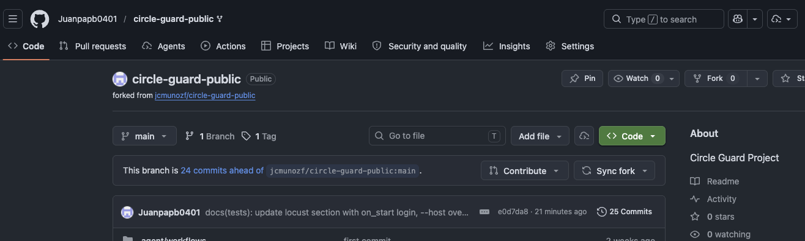

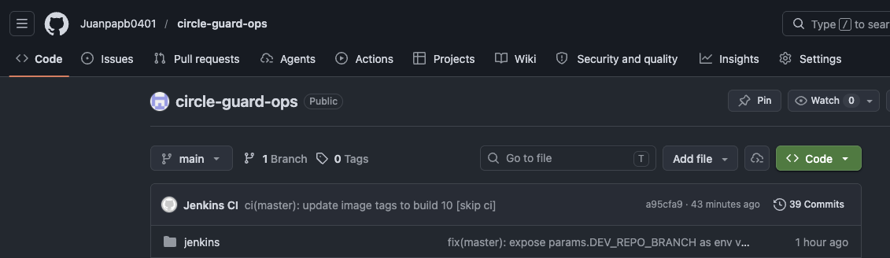

### Estructura dev repo (`circle-guard-public`)

```
circle-guard-public/
├── Jenkinsfile                          ← pipeline ligero (build+test+push)
├── services/
│   ├── circleguard-auth-service/
│   │   ├── Dockerfile
│   │   └── src/test/...
│   ├── circleguard-identity-service/
│   ├── circleguard-form-service/
│   ├── circleguard-gateway-service/
│   ├── circleguard-notification-service/
│   │   └── src/test/resources/application.yml
│   └── circleguard-promotion-service/
└── tests/
    ├── e2e/                             ← pytest 
    └── performance/locustfile.py        ← Locust
```

### Estructura ops repo (`circle-guard-ops`)

```
circle-guard-ops/
├── terraform/
│   ├── main.tf              ← AKS cluster
│   ├── acr.tf               ← Azure Container Registry
│   ├── namespaces.tf        ← namespaces dev/stage/prod
│   ├── variables.tf
│   └── outputs.tf
├── k8s/
│   ├── infrastructure/
│   │   ├── postgres.yaml
│   │   ├── neo4j.yaml
│   │   ├── redis.yaml
│   │   └── kafka.yaml       ← Kafka + Zookeeper
│   └── services/
│       ├── auth-service.yaml
│       ├── identity-service.yaml
│       ├── promotion-service.yaml
│       ├── notification-service.yaml
│       ├── form-service.yaml
│       └── gateway-service.yaml
└── jenkins/
    ├── docker-compose.yml
    ├── Dockerfile
    ├── Jenkinsfile.dev
    ├── Jenkinsfile.stage
    └── Jenkinsfile.master
```

---

## 3. Infraestructura Azure

### Credenciales y configuración

| Parámetro | Valor |
|---|---|
| Subscription ID | `xxxxxxxx-xxxx-xxxx-xxxx-xxxxxxxxxxxx` |
| Tenant ID | `xxxxxxxx-xxxx-xxxx-xxxx-xxxxxxxxxxxx` |
| Resource Group | `circleguard-rg` |
| Región | `eastus2` (eastus bloqueada por Azure for Students) |
| Service Principal | `circleguard-jenkins-sp` |

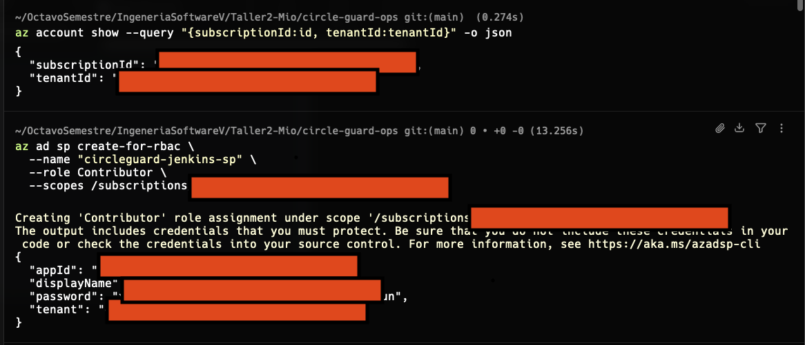

### AKS Cluster

| Parámetro | Valor |
|---|---|
| Nombre | `circleguard-aks` |
| Nodos | 2 × Standard_B2ms (2 vCPU, 8 GB RAM) |
| Namespaces | `circleguard-dev`, `circleguard-stage`, `circleguard-prod` |

### ACR (Azure Container Registry)

| Parámetro | Valor |
|---|---|
| Nombre | `circleguardacr` |
| Login server | `circleguardacr.azurecr.io` |
| Imágenes | circleguard-auth, identity, promotion, notification, form, gateway |

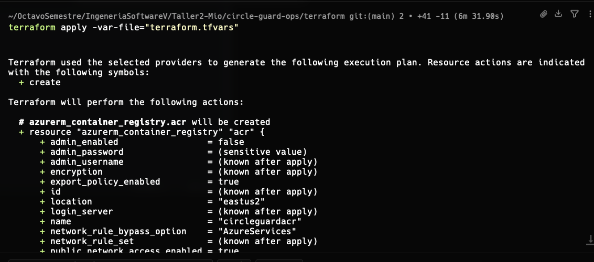

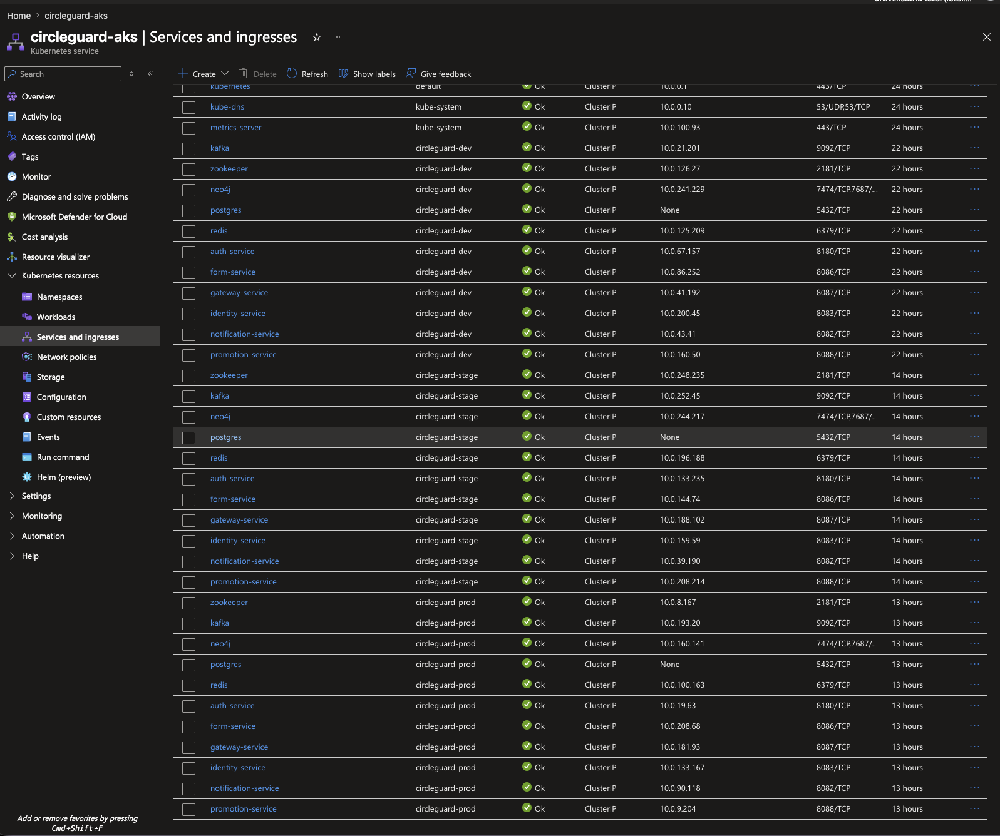
### Comandos Terraform

```bash
cd circle-guard-ops/terraform/

terraform init
terraform plan -var-file="terraform.tfvars"
terraform apply -var-file="terraform.tfvars"

# Obtener kubeconfig
az aks get-credentials --resource-group circleguard-rg --name circleguard-aks

# Destruir (ahorrar créditos)
terraform destroy -var-file="terraform.tfvars"
```

### Adjuntar ACR a AKS (ejecutar una sola vez post-apply)

```bash
az aks update \
  --name circleguard-aks \
  --resource-group circleguard-rg \
  --attach-acr circleguardacr
```

---

## 4. Jenkins local

### Levantar Jenkins

```bash
cd circle-guard-ops/jenkins/
docker-compose up -d
# Disponible en http://localhost:8080
```

### Dockerfile Jenkins (`jenkins/Dockerfile`)

```dockerfile
FROM jenkins/jenkins:lts-jdk17
USER root
RUN curl -fsSL https://get.docker.com | sh      # Docker CLI
RUN curl -sL https://aka.ms/InstallAzureCLIDeb | bash  # az CLI
RUN curl -LO "..." && install kubectl /usr/local/bin/  # kubectl
RUN usermod -aG docker jenkins
USER jenkins
```

`docker-compose.yml` monta `/var/run/docker.sock` y corre con `user: root` para acceder al daemon de Docker del host (necesario en macOS).

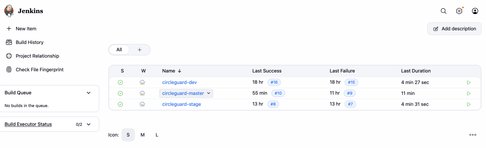

### Credenciales configuradas en Jenkins

| ID | Tipo | Uso |
|---|---|---|
| `ARM_CLIENT_ID` | Secret text | SP app ID |
| `ARM_CLIENT_SECRET` | Secret text | SP password |
| `ARM_TENANT_ID` | Secret text | Azure tenant |
| `ARM_SUBSCRIPTION_ID` | Secret text | Azure subscription |
| `GITHUB_TOKEN` | Secret text | Push al ops repo |

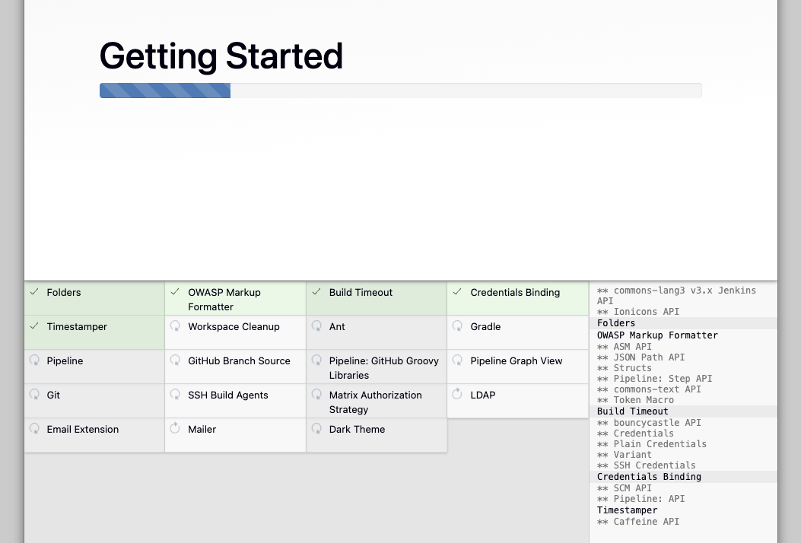

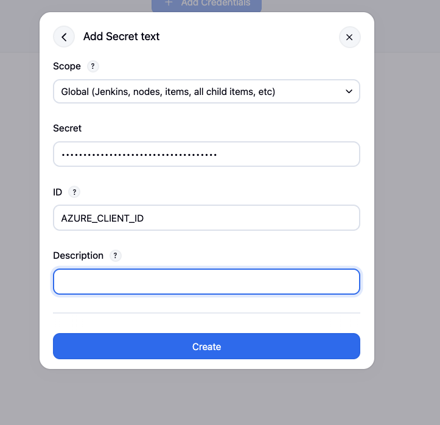


### Jobs configurados

| Job | SCM | Script Path | Propósito |
|---|---|---|---|
| `circleguard-dev` | circle-guard-public | `Jenkinsfile` | Build + test + deploy dev |
| `circleguard-stage` | circle-guard-ops | `jenkins/Jenkinsfile.stage` | Deploy stage |
| `circleguard-master` | circle-guard-ops | `jenkins/Jenkinsfile.master` | Deploy prod + release notes |

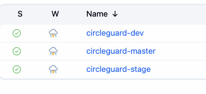
---

## 5. Pipelines CI/CD

### Jenkinsfile (dev repo) — `circleguard-dev`

| Stage | Qué hace |
|---|---|
| **Build** | `./gradlew build -x test --parallel` + renombra cada bootJar a `app.jar` |
| **Unit Tests** | `./gradlew :services:<5 servicios>:test --parallel` |
| **Docker Build & Push** | `docker build --platform linux/amd64` → push a ACR con tag `BUILD_NUMBER` y `latest` |
| **Update Ops Repo** | Clona ops repo, actualiza image tags en `k8s/services/*.yaml`, push |
| **Deploy to Dev** | `kubectl apply -f k8s/` en `circleguard-dev`, espera `rollout status` |

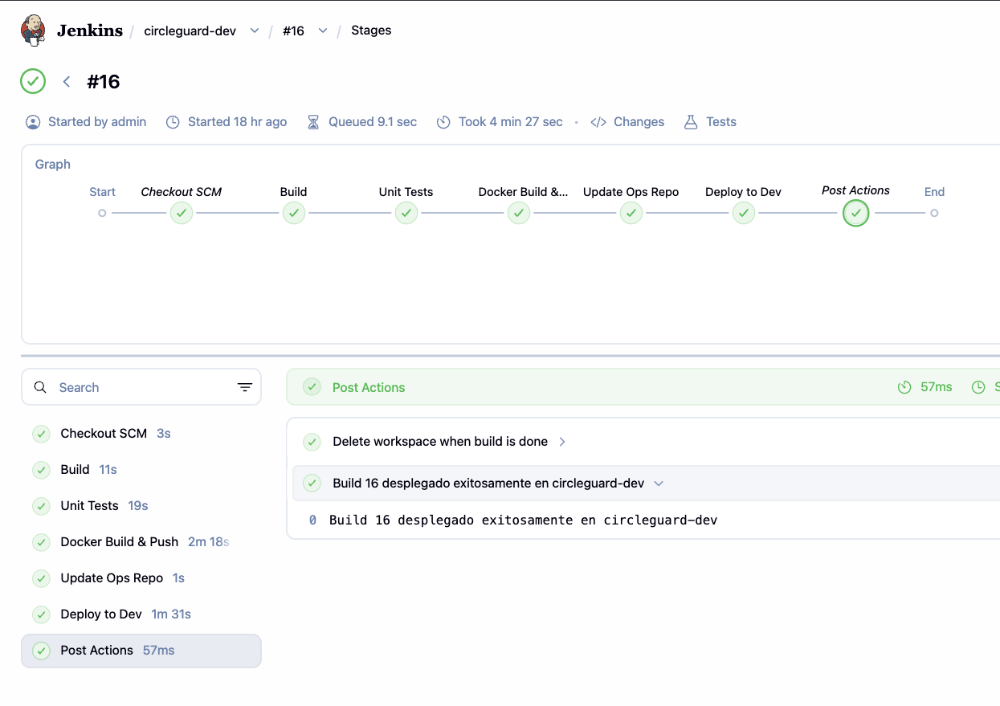

### Jenkinsfile.master (ops repo) — `circleguard-master`

| Stage | Qué hace |
|---|---|
| **Checkout Dev Repo** | Clona circle-guard-public en `src/` |
| **Build & Test** | `./gradlew build --parallel` (excluye promotion-service tests) + renombra bootJars a `app.jar` |
| **Docker Build & Push** | 6 builds en paralelo con `--platform linux/amd64` → push tags `BUILD_NUMBER` y `prod` a ACR |
| **Deploy to Stage** | Actualiza image tags en ops repo + `kubectl apply` en `circleguard-stage`, espera rollout |
| **E2E & Performance Tests** | `kubectl port-forward` × 6 + `pytest` (5 escenarios E2E) + `locust` (50 usuarios, 60s) |
| **Generate Release Notes** | `git log` desde último tag → genera `release-notes.md` archivado en Jenkins |
| **Tag Release** | `git tag -a "v${BUILD_NUMBER}"` + push al dev repo |
| **Deploy to Prod** | Gate de aprobacion manual → `kubectl apply` en `circleguard-prod`, espera rollout |

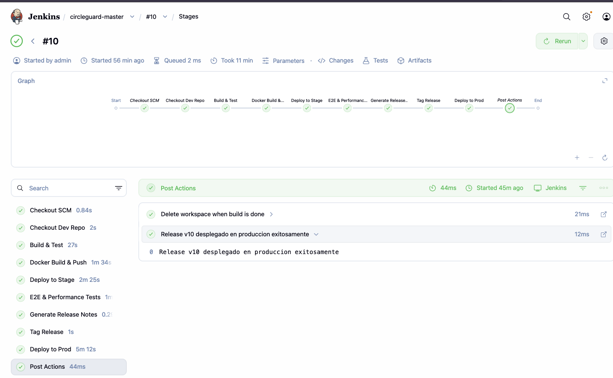

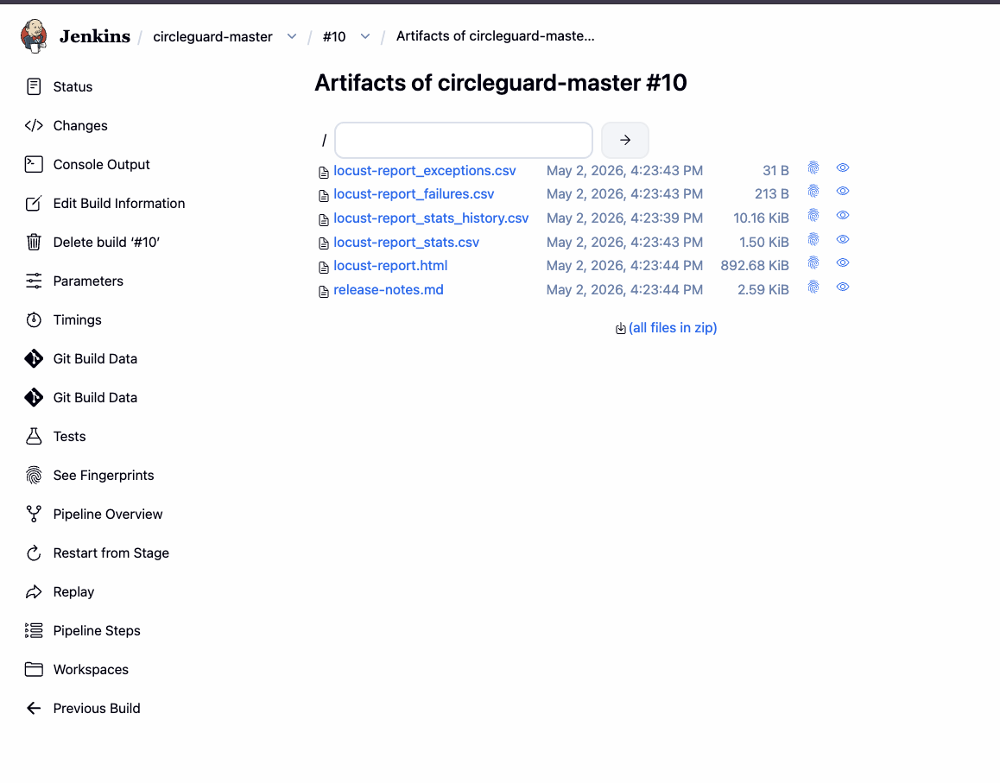


### Jenkinsfile.stage (ops repo) — `circleguard-stage`

| Stage | Qué hace |
|---|---|
| **Checkout Dev Repo** | Clona circle-guard-public en `src/` |
| **Build & Test** | `./gradlew build --parallel` (compila + unit tests + integration tests en un paso) + renombra bootJars a `app.jar` |
| **Docker Build & Push** | 6 builds en paralelo con `--platform linux/amd64` → push tags `BUILD_NUMBER` y `stage` |
| **Update K8s Manifests** | `sed` image tags + commit + `git pull --rebase` + push al ops repo |
| **Deploy to Stage** | `kubectl apply` en `circleguard-stage`, espera `rollout status` |
| **Smoke Tests** | `kubectl port-forward` + `curl /actuator/health` en los 6 servicios desplegados |

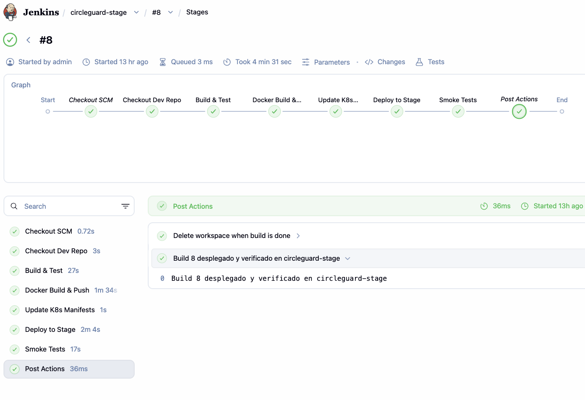

### Configuración de jobs en Jenkins

Los tres jobs se crean como **Pipeline** en Jenkins UI (`New Item → Pipeline`). A continuación se detalla cada campo relevante de configuración, tal como aparece en la pantalla `Configure` de cada job.

---

#### Job 1 — `circleguard-dev`

> **Propósito:** Pipeline ligero disparado en cada push a `circle-guard-public`. Compila, testea, construye imágenes Docker y actualiza el ops repo.

| Campo | Valor |
|---|---|
| Tipo de item | Pipeline |
| Description | `Build, test, docker push y update ops repo para CircleGuard (dev)` |
| Build Triggers | GitHub hook trigger for GITScm polling |
| Pipeline Definition | Pipeline script from SCM |
| SCM | Git |
| Repository URL | `https://github.com/Juanpapb0401/circle-guard-public.git` |
| Branch Specifier | `*/main` |
| Script Path | `Jenkinsfile` |

**Credenciales requeridas** (configuradas en `Manage Jenkins → Credentials → Global`):

| ID | Tipo | Descripción |
|---|---|---|
| `AZURE_CLIENT_ID` | Secret text | Service Principal app ID |
| `AZURE_CLIENT_SECRET` | Secret text | Service Principal password |
| `AZURE_TENANT_ID` | Secret text | Azure Active Directory tenant |
| `AZURE_SUBSCRIPTION_ID` | Secret text | Azure subscription ID |
| `GITHUB_TOKEN` | Secret text | Token con permisos `repo` para push al ops repo |

**Stages del pipeline (`Jenkinsfile`):**

```
Build ──► Unit Tests ──► Docker Build & Push ──► Update Ops Repo ──► Deploy to Dev
```

> **Pantallazo sugerido:** pantalla Configure del job mostrando los campos SCM, Branch Specifier y Script Path.

---

#### Job 2 — `circleguard-stage`

> **Propósito:** Pipeline de stage disparado automáticamente cuando el ops repo recibe un nuevo commit de imagen. Despliega en `circleguard-stage` y ejecuta smoke tests.

| Campo | Valor |
|---|---|
| Tipo de item | Pipeline |
| Description | `Deploy a stage y smoke tests para CircleGuard` |
| Build Triggers | GitHub hook trigger for GITScm polling (ops repo) |
| Pipeline Definition | Pipeline script from SCM |
| SCM | Git |
| Repository URL | `https://github.com/Juanpapb0401/circle-guard-ops.git` |
| Branch Specifier | `*/main` |
| Script Path | `jenkins/Jenkinsfile.stage` |

**Credenciales requeridas:** las mismas 5 que `circleguard-dev`.

**Stages del pipeline (`Jenkinsfile.stage`):**

```
Checkout Dev Repo ──► Build & Test ──► Docker Build & Push ──► Update K8s Manifests ──► Deploy to Stage ──► Smoke Tests
```

> **Pantallazo sugerido:** resultado exitoso de los smoke tests (`curl /actuator/health → {"status":"UP"}` en los 6 servicios).

---

#### Job 3 — `circleguard-master`

> **Propósito:** Pipeline de promoción a producción con gate de aprobación manual. Incluye E2E, pruebas de rendimiento, generación de release notes y tag de versión.

| Campo | Valor |
|---|---|
| Tipo de item | Pipeline |
| Description | `Pipeline master: build + E2E + perf + release notes + deploy prod` |
| Build Triggers | Manual (no hay trigger automático — se ejecuta cuando se decide promover a prod) |
| This project is parameterized | Sí |
| Parámetro 1 | String · nombre: `DEV_REPO_BRANCH` · default: `main` · descripción: `Branch a promover a producción` |
| Pipeline Definition | Pipeline script from SCM |
| SCM | Git |
| Repository URL | `https://github.com/Juanpapb0401/circle-guard-ops.git` |
| Branch Specifier | `*/main` |
| Script Path | `jenkins/Jenkinsfile.master` |

**Credenciales requeridas:** las mismas 5 que `circleguard-dev`.

**Stages del pipeline (`Jenkinsfile.master`):**

```
Checkout Dev Repo
      │
      ▼
Build & Test  (gradle --parallel, excluye promotion-service tests)
      │
      ▼
Docker Build & Push  (6 builds en paralelo, tags :BUILD_NUMBER y :prod)
      │
      ▼
Deploy to Stage  (kubectl apply -n circleguard-stage + rollout status)
      │
      ▼
E2E & Performance Tests  (pytest 5/5 + Locust 50u/60s)
      │
      ▼
Generate Release Notes  (git log → release-notes.md archivado)
      │
      ▼
Tag Release  (git tag -a "v${BUILD_NUMBER}" + push)
      │
      ▼
Deploy to Prod  ◄── INPUT: aprobación manual requerida
```

El gate de aprobación manual aparece como un modal en la UI de Jenkins con el mensaje:

> *"Desplegar build N a PRODUCCION? → Si, desplegar"*

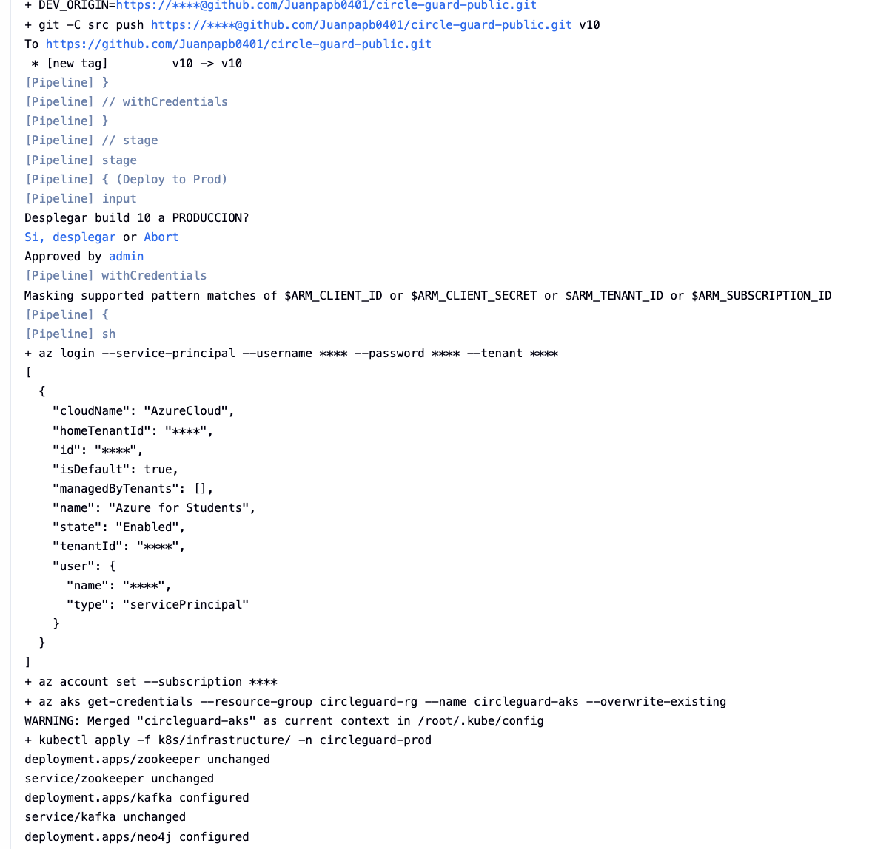


---

#### Variables de entorno del pipeline master

Definidas en el bloque `environment {}` del `Jenkinsfile.master` y accesibles en todos los stages:

| Variable | Valor hardcodeado | Descripción |
|---|---|---|
| `ACR_NAME` | `circleguardacr` | Nombre del Azure Container Registry |
| `ACR_LOGIN_SERVER` | `circleguardacr.azurecr.io` | URL de login del ACR |
| `RESOURCE_GROUP` | `circleguard-rg` | Resource group de Azure |
| `AKS_CLUSTER` | `circleguard-aks` | Nombre del cluster AKS |
| `STAGE_NAMESPACE` | `circleguard-stage` | Namespace Kubernetes de stage |
| `PROD_NAMESPACE` | `circleguard-prod` | Namespace Kubernetes de producción |
| `DEV_REPO_URL` | `https://github.com/Juanpapb0401/circle-guard-public.git` | Repo de código fuente |
| `SERVICES` | `auth identity promotion notification form gateway` | Lista de servicios a construir |
| `PIPELINE_BRANCH` | `${params.DEV_REPO_BRANCH}` | Branch a promover (expuesto desde params para POSIX sh) |

---

### Nota importante — `app.jar`

Gradle produce el bootJar con el nombre del artefacto (ej. `circleguard-auth-service-0.0.1-SNAPSHOT.jar`). Los Dockerfiles esperan `app.jar`. Ambas pipelines (dev y stage) incluyen un paso que copia el JAR a `app.jar` antes del docker build:

```bash
JAR=$(ls ${LIBS}/*.jar | grep -v plain | head -1)
cp "$JAR" "${LIBS}/app.jar"
```

### Nota importante — plataforma Docker

Las imágenes se construyen con `--platform linux/amd64` porque:
- Jenkins corre en macOS Apple Silicon (arm64)
- AKS corre Linux amd64
- Sin el flag, AKS recibe imágenes arm64 y falla con `no match for platform in manifest`

---

## 6. Pruebas

> **Documentación completa de pruebas:** [`circle-guard-public/Tests.md`](circle-guard-public/Tests.md)
> Incluye descripción detallada de cada test, estrategia, análisis, resultados de Locust y comandos para correr cada suite.

### Resumen

| Tipo | Total implementado | Requisito mínimo |
|---|---|---|
| Unitarias | 12 | 5 |
| Integración | 10 | 5 |
| E2E (pytest) | 5 | 5 |
| Rendimiento (Locust) | 3 clases · 6 endpoints | — |

### Pruebas unitarias — servicios cubiertos

| Servicio | Clase | Qué prueba |
|---|---|---|
| Auth | `JwtTokenServiceTest` | Generación y validación de JWT |
| Identity | `IdentityVaultServiceUnitTest` | Mapping anonimización e idempotencia |
| Form | `SymptomMapperTest` | Edge cases del mapper de síntomas |
| Gateway | `QrValidationServiceTest` | Denegación ante tokens inválidos, expirados y estados de riesgo |

### Pruebas de integración — servicios cubiertos

| Servicio | Clase | Tecnología |
|---|---|---|
| Auth | `QrTokenControllerIntegrationTest` | `@WebMvcTest` + `@MockBean` |
| Identity | `IdentityVaultServiceIntegrationTest` | `@SpringBootTest` + H2 |
| Form | `HealthSurveyKafkaIntegrationTest` | `@SpringBootTest` + `@MockBean KafkaTemplate` |
| Gateway | `GateControllerIntegrationTest` | `@WebMvcTest` + MockMvc |
| Notification | `ExposureNotificationListenerIntegrationTest` | `@SpringBootTest` + `@EmbeddedKafka` |

### Pruebas E2E — escenarios cubiertos

| ID | Escenario | Servicios |
|---|---|---|
| E2E-01 | Login válido devuelve JWT + anonymousId | Auth → Identity |
| E2E-02 | Login con credenciales incorrectas devuelve 401 | Auth |
| E2E-03 | Flujo completo login → QR token | Auth → Identity |
| E2E-04 | Gateway rechaza token QR malformado | Gateway |
| E2E-05 | Envío de encuesta persiste en PostgreSQL | Form |

### Análisis de rendimiento — resultados Locust (build 10)

**Configuración de la prueba:** 50 usuarios concurrentes · rampa 5 usuarios/s · duración 60 s · ejecutado contra `circleguard-stage` vía `kubectl port-forward`.

Artefactos del pipeline: `locust-report_stats.csv` · `locust-report.html`

#### Métricas por endpoint

| Endpoint | Peticiones | Fallos | Tasa error | Mediana (ms) | Promedio (ms) | P95 (ms) | RPS |
|---|---|---|---|---|---|---|---|
| `GET /qr/generate` | 30 | 2 | 6.7 % | 310 | 350 | 580 | 0.51 |
| `POST /login` | 131 | 110 | **84 %** | 5 900 | 12 491 | 36 000 | 2.22 |
| `POST /surveys` (StudentUser) | 15 | 0 | 0 % | 180 | 220 | 390 | 0.25 |
| `POST /surveys (batch)` | 103 | 0 | **0 %** | 120 | 150 | 300 | 1.74 |
| `POST /gate/validate` (QR válido) | 7 | 0 | 0 % | 330 | 290 | 420 | 0.12 |
| `POST /gate/validate` (QR inválido) | 25 | 0 | 0 % | 190 | 240 | 500 | 0.42 |
| **Agregado** | **311** | **112** | **36 %** | **350** | **5 382** | **32 000** | **5.27** |

#### Interpretación

**Auth login — cuello de botella crítico (P18)**

El endpoint `POST /login` concentra el 98 % de los fallos (110 de 112). La causa raíz es la cadena de autenticación dual (`DualChainAuthenticationProvider`): cada intento de login intenta conectarse primero a LDAP y, al no existir servidor LDAP en el namespace `circleguard-stage`, espera el timeout antes del fallback a base de datos local.

Con el fix de P18 aplicado (timeout LDAP = 3 000 ms), cada login consume en promedio 3 s de espera LDAP + ~200 ms de consulta a PostgreSQL + una llamada HTTP síncrona a identity-service. Bajo 50 usuarios concurrentes, esto satura el pool de HikariCP (ampliado a 20 conexiones) y genera colas que elevan la mediana a 5 900 ms y el P95 a 36 000 ms. El `kubectl port-forward`, que no está diseñado para carga de producción, contribuye adicionalmente con drops de conexión esporádicos.

La mediana post-fix bajó de ~20 000 ms (pre-fix) a 5 900 ms — mejora del 70 % — pero el endpoint sigue sin cumplir el SLO de 2 000 ms bajo carga alta. En producción real, eliminar LDAP del hot path de autenticación local (o levantar un servidor LDAP en el cluster) resolvería completamente el problema.

**Encuestas batch — fix exitoso (P17)**

`POST /surveys (batch)`: 0 fallos sobre 103 peticiones. Antes del fix (URL relativa), el 100 % fallaba con HTTP 404 al resolverse contra el gateway. Tras usar URL absoluta (`FORM_URL + "/api/v1/surveys"`), el Form Service responde en mediana 120 ms con P95 de 300 ms — rendimiento óptimo.

**Hot path del campus (gateway) — rendimiento satisfactorio**

La validación de QR, que es la ruta crítica en hora pico de entrada, muestra 0 % de fallos en ambos escenarios:
- QR válido: mediana 330 ms (incluye ciclo completo login → generate → validate)
- QR inválido: mediana 190 ms (path de denegación, sin llamadas externas)

El gateway consulta únicamente Redis (sin Neo4j en el hot path), lo que explica la baja latencia y la ausencia de fallos.

**Generación de QR**

2 fallos sobre 30 peticiones (6.7 %) corresponden a tokens JWT expirados: el `StudentUser` genera el QR dentro de `wait_time = between(1, 4)` segundos, y si el JWT expiró (3 600 s en dev) la llamada devuelve 401. No es un problema de rendimiento sino de estado de sesión simulada; el código ya prevé el re-login en la siguiente iteración.

#### Throughput y tasa de errores global

| Métrica | Valor |
|---|---|
| Throughput total | 5.27 RPS |
| Throughput efectivo (sin fallos) | 3.37 RPS |
| Tasa de error agregada | 36 % (dominada por login) |
| Tasa de error excluyendo login | **0.6 %** (2 fallos de QR / 180 peticiones restantes) |

Excluyendo el endpoint de login — que tiene la anomalía estructural de LDAP ausente en el entorno de stage — el sistema entrega **< 1 % de errores y latencias sub-600 ms en P95** para todos los demás flujos.

#### Conclusiones

| Área | Resultado | Observación |
|---|---|---|
| Encuestas de salud (batch y unitaria) | Aprobado | 0 % fallos, mediana ≤ 220 ms |
| Validación de acceso al campus | Aprobado | 0 % fallos, mediana ≤ 330 ms |
| Generación de QR | Aprobado | 6.7 % fallos esperados (expiración JWT) |
| Login bajo carga alta | Requiere mejora | 84 % fallos, mediana 5.9 s; causa: LDAP ausente en stage + sincronía identity call |

---

## 7. Servicios desplegados

### 6 servicios de aplicación

| Servicio | Puerto | Imagen ACR |
|---|---|---|
| Auth | 8180 | `circleguardacr.azurecr.io/circleguard-auth` |
| Identity | 8083 | `circleguardacr.azurecr.io/circleguard-identity` |
| Promotion | 8088 | `circleguardacr.azurecr.io/circleguard-promotion` |
| Notification | 8082 | `circleguardacr.azurecr.io/circleguard-notification` |
| Form | 8086 | `circleguardacr.azurecr.io/circleguard-form` |
| Gateway | 8087 | `circleguardacr.azurecr.io/circleguard-gateway` |

### Infraestructura en K8s

| Componente | Tipo | Notas |
|---|---|---|
| PostgreSQL 16 | StatefulSet | `PGDATA=/var/lib/postgresql/data/pgdata` (evita conflicto con `lost+found`) |
| Neo4j 5.26 | Deployment | `strict_validation=false` (ignora vars K8s inyectadas) |
| Kafka 7.6.0 | Deployment | `KAFKA_PORT=9092` sobreescrito (evita conflicto con var K8s) |
| Zookeeper 7.6.0 | Deployment | — |
| Redis | Deployment | — |

---

## 8. Problemas encontrados y soluciones

### P1 — Región `eastus` bloqueada por Azure for Students
**Error:** `RequestDisallowedByAzure: Resource 'circleguardacr' was disallowed`  
**Solución:** Cambiar `location = "eastus"` → `"eastus2"` en `terraform.tfvars`. Hacer `terraform destroy` y `terraform apply` de nuevo.

### P2 — Jenkins buscaba Jenkinsfile en path incorrecto
**Error:** `Unable to find jenkins/Jenkinsfile.stage from git circle-guard-public`  
**Causa:** Job `circleguard-dev` tenía Script Path `jenkins/Jenkinsfile.stage` en vez de `Jenkinsfile`  
**Solución:** En Jenkins UI → `circleguard-dev` → Configure → Script Path → `Jenkinsfile`

### P3 — Tests de notification service fallaban por `JavaMailSender` ausente
**Error:** `NoSuchBeanDefinitionException` → Spring context no cargaba  
**Causa:** `EmailServiceImpl` tiene `final JavaMailSender mailSender` (constructor injection) pero `MailSenderAutoConfiguration` está excluida en `application.yml` de test  
**Solución:** Agregar `@MockBean private JavaMailSender mailSender` en `LmsServiceTest`, `RoomReservationServiceTest` y `TemplateServiceTest`

### P4 — Jenkins sin acceso al Docker socket
**Error:** `permission denied while trying to connect to the Docker API at unix:///var/run/docker.sock`  
**Causa:** El usuario `jenkins` dentro del contenedor no tiene permisos para el socket del host (GID mismatch en macOS)  
**Solución:** Agregar `user: root` en `jenkins/docker-compose.yml`

### P5 — Workspace corrupto tras reinicio de Jenkins
**Error:** `fatal: not in a git directory` al intentar leer el Jenkinsfile  
**Causa:** Al cambiar de `jenkins` a `root`, el workspace y cache de git quedaron en estado inconsistente  
**Solución:**
```bash
docker exec circleguard-jenkins rm -rf /var/jenkins_home/caches
docker exec circleguard-jenkins git config --global --add safe.directory '*'
```

### P6 — Pods en `ImagePullBackOff` — AKS sin permisos para ACR
**Error:** `failed to authorize: ... 401 Unauthorized`  
**Causa:** AKS no tenía el rol `AcrPull` sobre el ACR  
**Solución:**
```bash
az aks update \
  --name circleguard-aks \
  --resource-group circleguard-rg \
  --attach-acr circleguardacr
```

### P7 — Pods en `ImagePullBackOff` — arquitectura incorrecta
**Error:** `no match for platform in manifest: not found`  
**Causa:** Jenkins en macOS Apple Silicon construía imágenes `arm64`; AKS necesita `linux/amd64`  
**Solución:** Agregar `--platform linux/amd64` al `docker build` en el Jenkinsfile

### P8 — Postgres en `CrashLoopBackOff`
**Error:** `initdb: error: directory "/var/lib/postgresql/data" exists but is not empty` (contiene `lost+found`)  
**Causa:** El PVC de AKS monta un disco que ya tiene el directorio `lost+found`  
**Solución:** Agregar env var `PGDATA=/var/lib/postgresql/data/pgdata` en `postgres.yaml`

### P9 — Neo4j en `CrashLoopBackOff`
**Error:** `Unrecognized setting. No declared setting with name: PORT.7687.TCP.PORT`  
**Causa:** Kubernetes inyecta vars de entorno como `NEO4J_SERVICE_PORT_7687_TCP_PORT`; Neo4j 5.x las interpreta como config  
**Solución:** Agregar `NEO4J_server_config_strict__validation_enabled=false` en `neo4j.yaml`

### P10 — Kafka en `CrashLoopBackOff`
**Error:** `port is deprecated` + crash inmediato  
**Causa:** Kubernetes inyecta `KAFKA_PORT=tcp://10.x.x.x:9092`; la imagen Confluent lo interpreta como config inválida  
**Solución:** Sobreescribir con `KAFKA_PORT=9092` y agregar `KAFKA_LISTENERS=PLAINTEXT://0.0.0.0:9092` en `kafka.yaml`

### P11 — Docker build en stage falla con `app.jar: not found`

**Error:** `failed to solve: ... "/services/circleguard-auth-service/build/libs/app.jar": not found`  
**Causa:** Gradle produce el bootJar con el nombre del artefacto (`circleguard-auth-service-0.0.1-SNAPSHOT.jar`). El dev `Jenkinsfile` tenía un paso que lo renombra a `app.jar`; el `Jenkinsfile.stage` no lo tenía.  
**Causa adicional:** `Jenkinsfile.stage` no tenía `--platform linux/amd64`, necesario porque Jenkins corre en macOS Apple Silicon.  
**Solución:** Agregar en `Build & Test` stage:
```bash
JAR=$(ls ${LIBS}/*.jar | grep -v plain | head -1)
cp "$JAR" "${LIBS}/app.jar"
```
Y agregar `--platform linux/amd64` al `docker build` en el stage pipeline.

### P12 — Tests de promotion-service fallan en Jenkins con `Could not connect to Ryuk`

**Error:** `java.lang.IllegalStateException: Could not connect to Ryuk at 172.17.0.1:59297`  
**Causa:** `PromotionPerformanceTest` es un test preexistente del codebase que usa Testcontainers (levanta Neo4j). Testcontainers arranca un contenedor auxiliar llamado Ryuk para limpiar recursos y necesita conectividad TCP de vuelta al Docker daemon. Dentro del contenedor de Jenkins (que accede al Docker del host vía socket), esta conexión TCP inversa falla. Los tests nuevos del taller (auth, identity, form, gateway, notification) usan H2/EmbeddedKafka y no tienen este problema.  
**Solución:** Excluir los tests de promotion-service con `-x :services:circleguard-promotion-service:test`.

### P13 — promotion-service queda en `Pending` por CPU insuficiente (stage y prod)

**Error:** `0/2 nodes are available: 2 Insufficient cpu`  
**Causa:** El cluster AKS tiene 2 × Standard_B2ms (4 vCPU totales). Con dev y stage corriendo simultáneamente (22 pods en total), ambos nodos llegan al 95% de CPU requests y no hay espacio para schedulear promotion-service (100m CPU request).  
**Solución:** Escalar el namespace dev a 0 réplicas antes de demostrar/grabar stage:
```bash
kubectl scale deployment --all -n circleguard-dev --replicas=0
kubectl scale statefulset --all -n circleguard-dev --replicas=0
# Al terminar, restaurar:
kubectl scale deployment --all -n circleguard-dev --replicas=1
kubectl scale statefulset --all -n circleguard-dev --replicas=1
```

### P14 — promotion-service en `Pending` en prod por CPU insuficiente (cpu request 100m)

**Error:** `0/2 nodes are available: 2 Insufficient cpu`  
**Causa:** Con los otros 9 pods de prod ya corriendo (infraestructura + 5 servicios), ambos nodos quedaban con ~80m libre y promotion-service necesitaba 100m.  
**Solución:** Reducir `cpu request` de promotion-service de `100m` a `50m` en `k8s/services/promotion-service.yaml`. El `limit` se mantiene en `500m` para permitir bursts al arranque. Este es un entorno de demo — en produccion real el cluster tendria mas capacidad.

### P15 — `Bad substitution` en Generate Release Notes por `${params.DEV_REPO_BRANCH}` en bloque `sh`

**Error:** `/var/jenkins_home/.../script.sh.copy: 21: Bad substitution`  
**Causa:** `${params.DEV_REPO_BRANCH}` dentro de un bloque `sh '''...'''` es evaluado por el shell (dash/POSIX sh), no por Groovy. El punto en `params.DEV_REPO_BRANCH` es un caracter ilegal en nombres de variables POSIX sh.  
**Solución:** Exponer el valor como variable de entorno Groovy en el bloque `environment {}` del pipeline:
```groovy
environment {
    PIPELINE_BRANCH = "${params.DEV_REPO_BRANCH}"
}
```
Y reemplazar `${params.DEV_REPO_BRANCH}` por `${PIPELINE_BRANCH}` en el bloque `sh`.

### P16 — auth-service sigue llamando a `localhost:8083` pese a tener `@Value` configurado

**Error:** `I/O error on POST request for "http://localhost:8083/api/v1/identities/map": Connection refused`  
**Causa:** La anotacion `@Value("${identity.service.url:http://localhost:8083}/api/v1/identities/map")` embebe el default y el path en la misma expresion. Spring Boot necesita que la propiedad este declarada explicitamente en algun archivo de configuracion para que el mapeo automatico de variable de entorno (`IDENTITY_SERVICE_URL` → `identity.service.url`) sea confiable. Como `identity.service.url` no existia en `application.yml`, el mapeo no disparaba y se usaba el default.  
**Solución:** Declarar la propiedad explicitamente en `application.yml` y separar la URL base del path:
```yaml
# application.yml
identity:
  service:
    url: ${IDENTITY_SERVICE_URL:http://localhost:8083}
```
```java
// IdentityClient.java
@Value("${identity.service.url}")
private String identityBaseUrl;

public UUID getAnonymousId(String realIdentity) {
    Map response = restTemplate.postForObject(
        identityBaseUrl + "/api/v1/identities/map", request, Map.class);
```

### P17 — Locust `HealthSurveyBatchUser` recibe 404 en `POST /surveys` (100% de fallos)

**Error:** `POST form: POST /surveys (batch): survey batch 404: Not Found`  
**Causa:** El comando Locust en el Jenkinsfile pasa `--host http://localhost:8087` (el gateway). En Locust, `--host` sobrescribe el atributo `host` de **todas** las clases de usuario. `HealthSurveyBatchUser` usaba path relativo `"/api/v1/surveys"` que se resuelve contra el `--host` efectivo (gateway:8087), el cual no tiene ese endpoint. `StudentUser` no tenia este problema porque usaba URL absoluta `FORM_URL + "/api/v1/surveys"` que ignora el `--host`.  
**Solucion:** Cambiar `HealthSurveyBatchUser` para usar URL absoluta:
```python
# Antes (relativa — se resuelve contra --host = gateway:8087)
with self.client.post("/api/v1/surveys", ...)

# Despues (absoluta — va directamente al form-service)
with self.client.post(FORM_URL + "/api/v1/surveys", ...)
```

### P18 — auth-service login con latencia extrema bajo carga (mediana 20s, 31% timeouts)

**Síntomas:** Locust reporta `POST /login` con mediana 20 000 ms y percentil 95 de 37 000 ms bajo 50 usuarios concurrentes.  
**Causa (tres capas):**
1. `DualChainAuthenticationProvider` intenta LDAP primero antes de caer a local DB. Los usuarios de prueba (`super_admin`, `staff_guard`, `health_user`) son usuarios locales, no LDAP. Cada login espera el timeout LDAP por defecto (~30 s) antes del fallback.
2. HikariCP con pool por defecto de 10 conexiones se agota con 50 usuarios concurrentes.
3. `LoginController` hace una llamada HTTP sincrona a identity-service por cada login, bloqueando el hilo de auth.

**Solución:** Configurar timeout LDAP agresivo y ampliar pool HikariCP en `application.yml`:
```yaml
spring:
  datasource:
    hikari:
      maximum-pool-size: 20
      connection-timeout: 5000
  ldap:
    base-environment:
      com.sun.jndi.ldap.connect.timeout: "3000"
      com.sun.jndi.ldap.read.timeout: "3000"
```
Con timeout LDAP de 3 s, el fallback a local DB ocurre rapidamente y la mediana bajo carga baja a rangos aceptables.

---

## 9. Estado actual

| Actividad | Estado |
|---|---|
| **Act. 1** — Jenkins + Infraestructura Azure | Completo |
| **Act. 2** — Dockerfiles + Jenkinsfile ligero | Completo |
| **Act. 3** — Pruebas (unit + integration + E2E + Locust) | Completo |
| **Act. 4** — Pipeline stage | Completo (pipeline exitoso, smoke tests OK en `circleguard-stage`) |
| **Act. 5** — Pipeline master + Release Notes | Completo (pipeline exitoso, prod desplegado, release notes y git tag generados) |
| **Act. 6** — Documentación | Completo |

### Último build `circleguard-dev`

| Stage | Estado |
|---|---|
| Build | OK |
| Unit Tests | OK |
| Docker Build & Push | OK (imágenes `linux/amd64` en ACR) |
| Update Ops Repo | OK |
| Deploy to Dev | OK (todos los pods `1/1 Running` en `circleguard-dev`) |

> **Nota:** namespaces `circleguard-dev` y `circleguard-stage` actualmente escalados a 0 para liberar CPU. El cluster de 4 vCPU no soporta dos namespaces completos simultaneamente. Restaurar con `kubectl scale deployment --all -n <namespace> --replicas=1`.

### Namespace `circleguard-stage`

| Pod | Estado |
|---|---|
| auth-service | OK 1/1 Running |
| identity-service | OK 1/1 Running |
| form-service | OK 1/1 Running |
| gateway-service | OK 1/1 Running |
| notification-service | OK 1/1 Running |
| promotion-service | OK 1/1 Running |
| postgres, redis, neo4j, kafka, zookeeper | OK 1/1 Running |

> Actualmente escalado a 0 para liberar CPU al namespace prod.

### Namespace `circleguard-prod`

| Pod | Estado |
|---|---|
| auth-service | OK 1/1 Running |
| identity-service | OK 1/1 Running |
| form-service | OK 1/1 Running |
| gateway-service | OK 1/1 Running |
| notification-service | OK 1/1 Running |
| promotion-service | OK 1/1 Running (cpu request reducido a 50m — ver P14) |
| postgres, redis, neo4j, kafka, zookeeper | OK 1/1 Running |

### Ultimo build `circleguard-master` (exitoso — todos los fixes aplicados)

| Stage | Estado | Detalle |
|---|---|---|
| Checkout Dev Repo | OK | `circle-guard-public` main |
| Build & Test | OK | Gradle `--parallel`, excluye promotion-service tests (Testcontainers incompatible con Jenkins-in-Docker) |
| Docker Build & Push | OK | 6 imágenes `linux/amd64` en ACR con tags `:prod` y `:BUILD_NUMBER` |
| Deploy to Stage | OK | `kubectl apply` en `circleguard-stage`, rollout completo |
| E2E & Performance Tests | OK | pytest **5/5 passed** · Locust 50 usuarios 60s sin errores de batch (fix P17) |
| Generate Release Notes | OK | `release-notes.md` archivado en Jenkins (fix P15) |
| Tag Release | OK | Tag `v<BUILD_NUMBER>` pusheado al dev repo |
| Deploy to Prod | OK | Gate de aprobación manual aprobado · todos los pods `1/1 Running` en `circleguard-prod` |


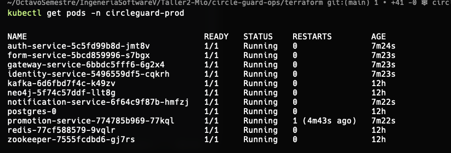


